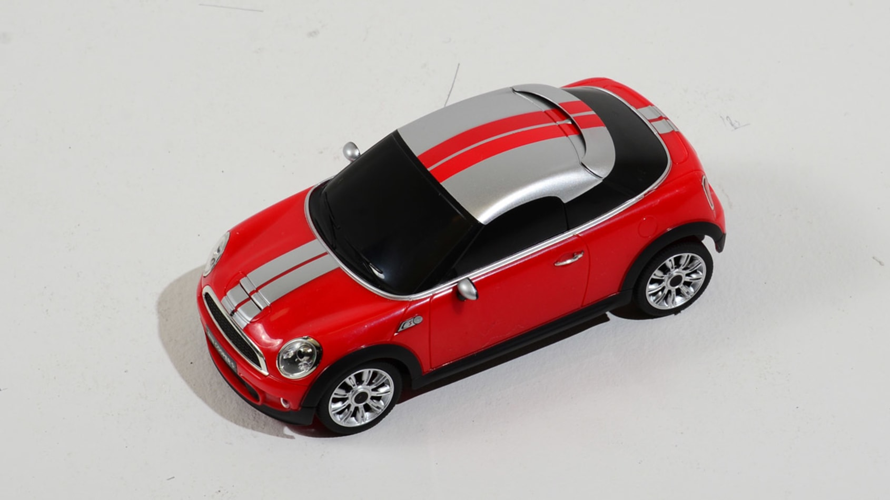
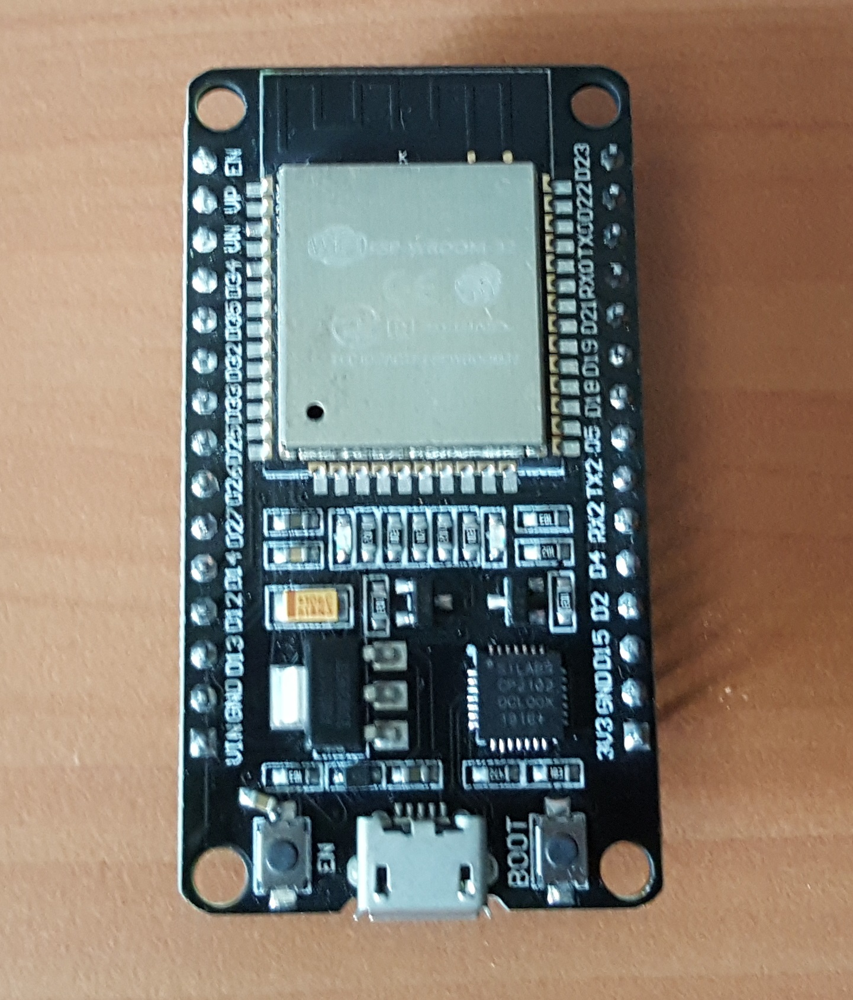
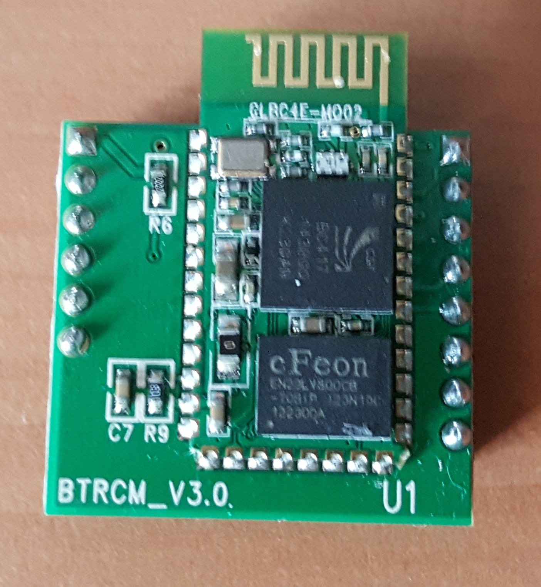
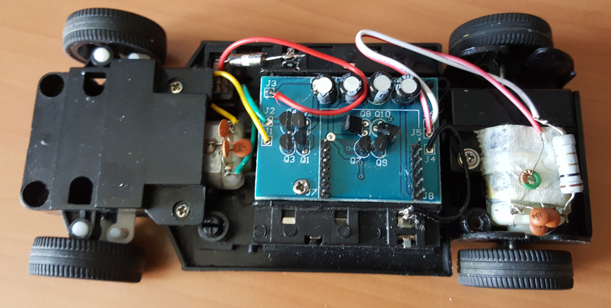

# BeeWi Mini Cooper - Robot ESP32

Projet qui permet d'interfacer la voiture bluetooth avec un Esp32 afin de la commander en Wifi avec Python et un joystick.

<p align="center">
 
</p>

## Matériel

Pour ce projet, on va utiliser une carte ESP32 qui va remplacer le module bluetooth de la voiture. 

<p align="center">
<table>
	<tbody>
		<tr>
			<td>   </td>
			<td>   </td>
		</tr>
		<tr>
			<td> Carte ESP32  </td>
			<td> Module Bluetooth </td>
		</tr>
	</tbody>
</table>
</p>
On remplace entièrement le module bluetooth par la carte ESP32.

<br>
<br>

<p align="center">
 
<br>
Interrieur de la voiture avec les connectiques.
</p>

On retrouve alors la connectique suivante avec les broches sur la voiture :


<table>
<tbody>
  <tr>
    <td rowspan="6">Avant <br> de la voiture</td>
    <td>GND</td>
    <td>GND</td>
    <td rowspan="6">Arriere <br> de la voiture</td>
  </tr>
  <tr>
    <td>Avancer</td>
    <td>NC</td>
  </tr>
  <tr>
    <td>Reculer</td>
    <td>NC</td>
  </tr>
  <tr>
    <td>Gauche</td>
    <td>NC</td>
  </tr>
  <tr>
    <td>Droite</td>
    <td>NC</td>
  </tr>
  <tr>
    <td>NC</td>
    <td>+3V</td>
  </tr>
</tbody>
</table>


## Cablage ESP
On peut maintenant cabler ces broches avec l'ESP32.


<table>
<thead>
  <tr>
    <th>Fonction<br></th>
    <th>GPIO</th>
  </tr>
</thead>
<tbody>
  <tr>
    <td>Avancer</td>
    <td>12</td>
  </tr>
  <tr>
    <td>Reculer</td>
    <td>13</td>
  </tr>
  <tr>
    <td>Gauche</td>
    <td>15</td>
  </tr>
  <tr>
    <td>Droite</td>
    <td>14</td>
  </tr>
</tbody>
</table>


## Utlisation rapide

### Code ESP

Compiler le code ESP32 avec Arduino (dossier server) en remplaçant vos identifiants wifi :
```c++
const char *ssid = "...";
const char *password = "...";
```

La ligne `#include "credential.h"` est à supprimer si vous ne créez pas de fichier avec vos identifiants.

Ce script utilise les librairie suivantes (à installer avec votre Arduino IDE) :
```c++
WiFi
ESPAsyncWebServer
ArduinoJson
```

### Code Python

Ce code python est à executer sur un l'ordianateur. J'utilise un joystick branché en USB afin de contrôler la voiture. 

Ce script utilise les différentes bibliothèques Python :

```
requests
time
pygame
json
```

Rappel : pour installer une bibliothèque :
```python
py -m pip install la_blibliothèque
```


## Source

Afin de faire la communication par Wifi, je me base sur [ce post Stackoverflow](https://stackoverflow.com/questions/59118310/how-to-send-string-to-esp32-using-http). Il permet une communication Async en get-post.

